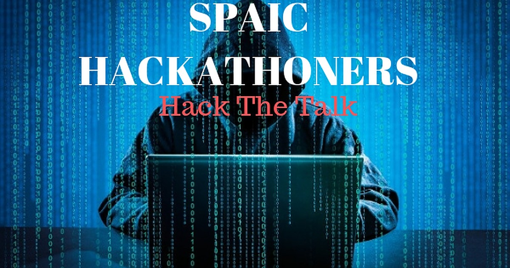
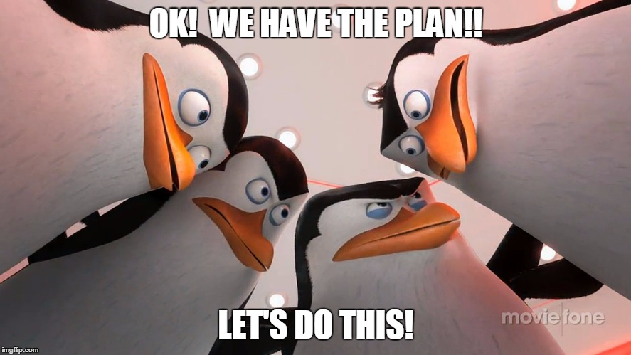

# Virtual-Hackathon
Participate in virtual hackathon for scholars of [Secure and Private AI Scholarship 
Challenge from Facebook](https://eu.udacity.com/facebook-AI-scholarship) conducted by #sg_hackathon_orgnizrs. Come join us let's for a fun filled weekend of coding and competing against each other.

## 1. When is it?
Every Weekend. The first one is this weekend. It runs from **Saturday @ 00:01am GMT** to **Sunday @ 11:59pm GMT**.

## 2. Where is it?
The dataset and the commits will be made on Kaggle on the [SPAIC HACKATHON](https://www.kaggle.com/spaics) Organization page. If you aren't used to Kaggle Kernels this is the perfect occasion to start learning. (Datasets will be added on this page before the hackathon begins)

## 3. How to participate?
Use this form to sign up. You can participate alone or as part of a team of up to 4 individuals. Only 1 member of the team needs to fill the form. http://bit.ly/hackathon-signup . Please join the #sg_hackathon-orgnizrs channel.

## 4. How will submissions be evaluated?
Submissions will be evaluated by members of the community with a background in DS, DL or ML on the following criteria: **accuracy**, **accuracy (loss) on unseen data**, **model efficiency**, **time of commit**.

## 5. When will results be announced?*
On Tuesday.

## RULES
1. Teams should be made up of at most 4 individuals.
2. Kernels must be committed before **Sunday @ 11:59pm GMT**. No points are gained for submitting before this time but all submissions after this time will not be accepted. **Any teams that make any changes to their kernel after this time will be disqualified**
3. Please include short description/summary of your
 - Model architecture and hyperparameters
 - and Why you used these models 
 should be included at the top of your kernel (1st or 2nd cell).
 This will be give our judges an idea about what you have done.
 
Please check in every 8hrs in the #sg_hackathon-orgnizrs, so we know you are still there :). Feel free to send pictures of you or your team working on the hackathon, send text messages or motivational messages to motivate your peers. 

 
 
 
 
  *Participation is not mandatory for Secure and Private AI Challenge scholars.*

Judges: [George Christopoulos](https://github.com/geochri), [Amitrajit Bose](https://www.linkedin.com/in/amitrajitbose/),[Yemissi B. Kifouly](https://www.linkedin.com/in/yemissib-kifouly/), [Fairoza Amira Binti Hamzah](https://www.linkedin.com/in/fairoza-amira-binti-hamzah/), [Arka Chakraborty](https://www.linkedin.com/in/arka-chakraborty-96a336145/),[Anna Unger](https://www.linkedin.com/in/annakunger/)

Organizers: [Ngong Ivoline](https://www.linkedin.com/in/ivoline-ngong-96238899/),[Munira Omar](https://www.linkedin.com/in/munniomer/), [Mushrifah Hasan](http://www.linkedin.com/in/mushrifah-hasan), [Mahfuza Humayra Mohona](http://www.linkedin.com/in/mhmohona) and [Amina Assouane](https://www.linkedin.com/in/amina-assouane/)
